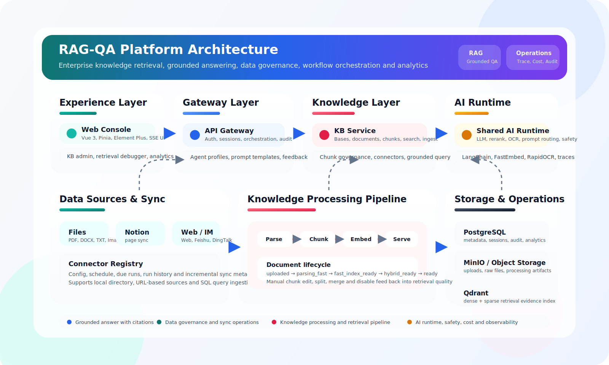

# RAG-QA 2.0

[](https://github.com/icefunicu/rag-qa-system/actions/workflows/ci.yml)
[](LICENSE)
[](https://github.com/icefunicu/rag-qa-system/stargazers)




一个面向中文场景的本地 RAG 问答系统。

如果你不熟悉技术，可以把它理解成一套“企业知识库问答平台”：

- 你上传公司制度、手册、合同、流程文档
- 系统把文档整理成可搜索的知识库
- 用户像聊天一样提问
- 系统回答时会尽量附上依据和引用位置，而不是只给一句模糊答案

这个仓库不是单页面演示，也不是只会“调用一个大模型”的 Demo。它包含前端、网关、知识库服务、异步处理 Worker、对象存储、向量检索、评测和运维脚本，适合做：

- 企业知识库问答
- 内部制度检索
- 多知识库统一聊天
- AI 应用后端工程样板
- RAG 产品原型和面试作品

## 目录

- [项目能做什么](#项目能做什么)
- [技术栈](#技术栈)
- [一句话看懂系统](#一句话看懂系统)
- [核心能力](#核心能力)
- [适合谁](#适合谁)
- [快速开始](#快速开始)
- [第一次使用怎么走](#第一次使用怎么走)
- [默认地址与账号](#默认地址与账号)
- [支持的文件与连接器](#支持的文件与连接器)
- [系统架构](#系统架构)
- [关键接口](#关键接口)
- [AI 能力与治理](#ai-能力与治理)
- [评测与回归](#评测与回归)
- [开发与运维](#开发与运维)
- [项目结构](#项目结构)
- [安全与边界](#安全与边界)
- [验证命令](#验证命令)
- [更多说明](#更多说明)

## 项目能做什么

- 创建多个知识库，分别管理不同业务域的文档
- 上传 `txt`、`pdf`、`docx`、`png`、`jpg`、`jpeg` 文档
- 异步解析文档并建立检索索引
- 提供单知识库问答和统一聊天两种入口
- 返回引用、证据状态、检索耗时、链路追踪信息
- 支持 SSE 流式回答
- 支持工作流重试与最小恢复能力
- 支持本地目录同步和 Notion 页面同步
- 支持文档切片人工治理、切片禁用、手工合并/拆分和检索调试工作台
- 支持统一连接器注册表，可配置 Web、飞书、钉钉和 SQL 数据源同步
- 支持 Agent Profile、Prompt 模板库和工具开关
- 支持个人视角与管理员视角的运营分析看板
- 支持提示词版本管理、模型路由、重排、视觉 OCR
- 支持评测基线、回归门禁和反馈闭环

## 技术栈

### 前端


### 后端与 AI


### 存储与基础设施


### 质量保障


## 一句话看懂系统

你可以把它理解成下面这条流水线：

1. 把文档放进系统。
2. 系统自动解析、切分、建立索引。
3. 用户提问。
4. 系统先检索证据，再生成答案。
5. 返回答案时一并附上引用、耗时、成本和追踪信息。

如果你只关心“能不能直接用”，答案是：可以，本仓库默认支持本地开发直接启动。

如果你关心“是不是工程化的”，答案也是：是，这里不是单脚本项目，而是完整服务拆分。

## 核心能力

| 能力 | 对非技术用户的意义 | 对技术团队的意义 |
| --- | --- | --- |
| 知识库管理 | 可以按部门、项目、主题分开管理资料 | 数据边界更清晰 |
| 多格式文档上传 | 常见办公文件可直接接入 | 复用统一 ingest 流程 |
| 证据化回答 | 回答尽量带出处，不只是“像是对的” | 便于做可信回答和排障 |
| 统一聊天 | 可以跨多个知识库问答 | 有统一网关和作用域控制 |
| 流式输出 | 回答时不用一直等到最后 | 更适合前端聊天体验 |
| 本地目录连接器 | 服务器目录里的文件可以同步进知识库 | 支持软删除和 freshness 元数据 |
| Notion 连接器 | 指定 Notion 页面可以同步进知识库 | 为企业连接器打下基线 |
| 工作流恢复 | 失败后可以从中间状态恢复，而不是整轮重跑 | 适合做复杂 AI 流程 |
| 评测门禁 | 能知道效果有没有变差 | 方便持续迭代 |
| 反馈闭环 | 用户可以标记回答好坏 | 反馈与模型、提示词、成本绑定 |

## 适合谁

- 想快速搭建一个“会回答公司文档问题”的产品原型
- 想做 AI 应用后端，而不是只写 Prompt Demo
- 想准备 RAG / AI 应用开发岗位作品集
- 想研究企业知识库、检索、评测、可观测性和治理问题

## 快速开始

### 环境要求

- Docker Desktop
- Python
- Node.js 和 npm
- PowerShell
- `make`

如果你的环境没有 `make`，也可以直接运行 `scripts/dev/*.ps1` 脚本。

### 1. 复制环境变量模板

```powershell
Copy-Item .env.example .env
```

### 2. 启动前检查

```powershell
make preflight
```

这个命令会检查：

- 文本编码
- 前端能否构建
- Python 代码能否编译
- 测试是否通过
- `docker compose` 配置是否有效

### 3. 初始化基础设施

```powershell
make init
```

它会准备：

- PostgreSQL
- MinIO
- Qdrant
- 数据库迁移和基础初始化

### 4. 启动完整项目

```powershell
make up
```

启动后会运行：

- `postgres`
- `minio`
- `qdrant`
- `kb-service`
- `kb-worker`
- `api-gateway`
- 前端开发服务

### 5. 停止项目

```powershell
make down
```

## 第一次使用怎么走

如果你不是开发者，按下面顺序理解最简单：

1. 打开前端页面。
2. 用默认账号登录。
3. 创建一个知识库。
4. 上传一份制度或说明文档。
5. 等待文档状态变成可查询。
6. 在问答页提问。
7. 看回答是否附带引用和证据。

如果你更偏技术，可以这样验证：

1. 登录获取 token。
2. 调用知识库创建接口。
3. 上传文档。
4. 轮询 ingest job。
5. 调用 `/api/v1/kb/query` 或统一聊天接口。

## 默认地址与账号

### 默认地址

- Web: `http://localhost:5173`
- Gateway: `http://localhost:8080`
- KB Service: `http://localhost:8300`
- Qdrant HTTP: `http://localhost:6333`
- Qdrant gRPC: `localhost:6334`
- MinIO API: `http://localhost:9000`
- MinIO Console: `http://localhost:9001`

### 健康检查地址

- Gateway `healthz`: `http://localhost:8080/healthz`
- Gateway `readyz`: `http://localhost:8080/readyz`
- Gateway `metrics`: `http://localhost:8080/metrics`
- KB Service `healthz`: `http://localhost:8300/healthz`
- KB Service `readyz`: `http://localhost:8300/readyz`
- KB Service `metrics`: `http://localhost:8300/metrics`

### 本地默认账号

默认账号来自 [`.env.example`](/E:/Project/rag-qa-system/.env.example)。

- 管理员：`admin@local`
- 普通成员：`member@local`
- 默认密码：`ChangeMe123!`

注意：

- 这些账号只适合本地开发
- 非本地环境必须覆盖 `JWT_SECRET`、`ADMIN_PASSWORD`、`MEMBER_PASSWORD`

## 支持的文件与连接器

### 支持的文档格式

- `txt`
- `pdf`
- `docx`
- `png`
- `jpg`
- `jpeg`

### 内置连接器

#### 1. 本地目录连接器

接口：

- `POST /api/v1/kb/connectors/local-directory/sync`

适合场景：

- 服务器上已经有一批文档，希望批量同步进知识库

特点：

- 只允许同步白名单目录
- 支持递归扫描
- 支持 dry run
- 支持“源文件消失后软删除”
- 会保存 `source_type`、`source_uri`、`source_updated_at`、`source_deleted_at`、`last_synced_at`

启用方式：

- 配置 `KB_LOCAL_CONNECTOR_ROOTS`

#### 2. Notion 连接器

接口：

- `POST /api/v1/kb/connectors/notion/sync`

适合场景：

- 想把指定的 Notion 页面同步进知识库

特点：

- 只按明确传入的 `page_ids` 同步
- 不扫描整个 Notion 工作区
- 会把页面转换成 UTF-8 文本后走统一 ingest 流程
- 同样支持软删除和治理字段

启用方式：

- `KB_NOTION_CONNECTOR_ENABLED=true`
- `KB_NOTION_API_TOKEN=<your-token>`

#### 3. 统一连接器注册表

接口：

- `GET /api/v1/kb/connectors`
- `POST /api/v1/kb/connectors`
- `GET /api/v1/kb/connectors/{connector_id}`
- `PATCH /api/v1/kb/connectors/{connector_id}`
- `DELETE /api/v1/kb/connectors/{connector_id}`
- `GET /api/v1/kb/connectors/{connector_id}/runs`
- `POST /api/v1/kb/connectors/{connector_id}/sync`
- `POST /api/v1/kb/connectors/run-due`

适合场景：

- 需要把“连接源配置”和“执行记录”从一次性接口提升为可治理对象
- 需要为后续定时调度、失败排查和多连接器运营提供统一入口

特点：

- 所有连接器共享统一的 `config + schedule + runs` 模型
- 支持立即执行和执行到期任务两种模式
- 会保存最近运行结果、下次执行时间和历史运行记录

#### 4. URL 类连接器（Web / 飞书 / 钉钉）

当前后端已支持以下 `connector_type`：

- `web_crawler`
- `feishu_document`
- `dingtalk_document`

特点：

- 当前落地方式是“按 URL 抓取正文并转成 UTF-8 文本后统一 ingest”
- 可选通过 `header_name + header_value_env` 注入鉴权头
- 适合先接文档页、帮助中心、制度页、开放平台文档等可抓取页面

#### 5. SQL 数据连接器

当前后端已支持 `connector_type=sql_query`。

特点：

- 只允许安全的单条 `SELECT` 查询
- 通过 `dsn_env` 读取部署环境中的数据库连接串
- 按记录行生成文档并走统一知识库 ingest 流程
- 适合报表表、制度表、FAQ 表等结构化文本同步

## 系统架构


这张图对应的是当前仓库的正式产品化架构表达，不再只是一个开发视角的服务连接图。它把系统拆成四层：

- Experience Layer：前端工作台，承载知识库管理、检索调试、分析看板和聊天交互
- Gateway Layer：统一会话入口、认证、工作流编排、Prompt 模板和 Agent Profile
- Knowledge Layer：知识库、文档、chunk 治理、检索和连接器同步
- Storage and Operations：PostgreSQL、MinIO、Qdrant 以及审计、追踪、成本分析等运维能力

### 每个服务负责什么

- `apps/web`：前端界面，负责登录、上传、检索、问答和查看结果
- `api-gateway`：统一聊天入口、认证、会话管理、工作流编排、审计聚合
- `kb-service`：知识库、文档、上传、检索、单库问答和连接器同步
- `kb-worker`：异步解析文档、OCR、切分、索引、向量化
- `packages/python/shared`：共享鉴权、存储、检索、追踪、模型调用等基础能力

### 文档进入系统后的状态

文档会大致经历以下阶段：

- `uploaded`
- `parsing_fast`
- `fast_index_ready`
- `hybrid_ready`
- `ready`

这意味着系统不是“上传后立刻可用”，而是走一条可观察、可追踪的异步处理链路。

## 关键接口

### 最常用的业务接口

认证：

- `POST /api/v1/auth/login`

知识库：

- `POST /api/v1/kb/bases`
- `GET /api/v1/kb/bases`
- `GET /api/v1/kb/bases/{id}`

上传与 ingest：

- `POST /api/v1/kb/uploads`
- `POST /api/v1/kb/uploads/{upload_id}/parts/presign`
- `POST /api/v1/kb/uploads/{upload_id}/complete`
- `GET /api/v1/kb/ingest-jobs/{job_id}`
- `POST /api/v1/kb/ingest-jobs/{job_id}/retry`

兼容旧入口：

- `POST /api/v1/kb/documents/upload`

检索与问答：

- `POST /api/v1/kb/retrieve`
- `POST /api/v1/kb/retrieve/debug`
- `POST /api/v1/kb/query`
- `POST /api/v1/kb/query/stream`

Chunk 治理：

- `GET /api/v1/kb/documents/{document_id}/chunks`
- `PATCH /api/v1/kb/chunks/{chunk_id}`
- `POST /api/v1/kb/chunks/{chunk_id}/split`
- `POST /api/v1/kb/chunks/merge`

连接器治理：

- `GET /api/v1/kb/connectors`
- `POST /api/v1/kb/connectors`
- `POST /api/v1/kb/connectors/{connector_id}/sync`
- `POST /api/v1/kb/connectors/run-due`

统一聊天：

- `POST /api/v1/chat/sessions`
- `PATCH /api/v1/chat/sessions/{id}`
- `POST /api/v1/chat/sessions/{id}/messages`
- `POST /api/v1/chat/sessions/{id}/messages/stream`
- `GET /api/v1/chat/sessions/{id}/workflow-runs`
- `GET /api/v1/chat/workflow-runs/{run_id}`
- `POST /api/v1/chat/workflow-runs/{run_id}/retry`
- `PUT /api/v1/chat/sessions/{id}/messages/{message_id}/feedback`

Agent 平台与 Prompt 模板：

- `GET /api/v1/platform/prompt-templates`
- `POST /api/v1/platform/prompt-templates`
- `GET /api/v1/platform/agent-profiles`
- `POST /api/v1/platform/agent-profiles`

分析看板：

- `GET /api/v1/analytics/dashboard?view=personal|admin&days=14`

系统接口：

- `GET /healthz`
- `GET /readyz`
- `GET /metrics`
- `GET /api/v1/audit/events`

完整接口说明请看：

- [API 规范](/E:/Project/rag-qa-system/docs/reference/api-specification.md)

### 一个最小登录示例

```bash
curl -X POST http://localhost:8080/api/v1/auth/login \
  -H "Content-Type: application/json" \
  -d '{"email":"admin@local","password":"ChangeMe123!"}'
```

### 一个最小问答示例

```bash
curl -X POST http://localhost:8300/api/v1/kb/query \
  -H "Authorization: Bearer <ACCESS_TOKEN>" \
  -H "Content-Type: application/json" \
  -d '{
    "base_id": "<KB_ID>",
    "question": "报销审批需要哪些角色签字？",
    "document_ids": []
  }'
```

典型返回字段：

- `answer`
- `answer_mode`
- `citations`
- `retrieval`
- `trace_id`

### 统一聊天返回什么

统一聊天不仅会返回答案，还会返回这些可治理字段：

- `execution_mode`
- `strategy_used`
- `evidence_status`
- `grounding_score`
- `refusal_reason`
- `latency`
- `cost`
- `trace_id`
- `llm_trace`
- `workflow_run`

这意味着你可以同时看到：

- 系统答了什么
- 为什么这么答
- 花了多久
- 大概花了多少钱
- 这次调用走了哪个模型和哪个提示词版本

## AI 能力与治理

### 1. 证据化回答

系统尽量基于检索到的内容作答，并返回：

- `citations`
- `grounding_score`
- `evidence_status`

这对非技术用户的意义是：你能看到“它为什么这么回答”。

### 2. 知识治理与检索调试

这次后端增强后，知识库不再只有“上传然后等待检索”这一条链路，还增加了人工治理入口：

- 可以查看文档的 chunk 明细
- 可以手工修正文案、禁用低质量噪音 chunk
- 可以手工拆分/合并切片并重建该文档索引
- 可以通过 `POST /api/v1/kb/retrieve/debug` 只看召回和 rerank 结果，不触发 LLM

这对运营或知识管理员的意义是：能更快定位“为什么没召回”“为什么召回错了”“哪些切片应该被人工修正”。

### 3. 统一聊天与执行模式

统一聊天支持两种主要模式：

- `grounded`：严格基于当前作用域检索结果作答
- `agent`：在统一聊天入口里走更复杂的内部编排，但最终仍然要求 grounded answer

### 4. 工作流恢复

统一聊天支持失败重试和最小恢复能力。

当前可以做到：

- 失败后查看 `workflow_run`
- 对失败 run 发起 retry
- 从 retrieval 或 generation checkpoint 恢复，而不是每次整轮重跑

### 5. Agent 工作台与 Prompt 模板

后端已补齐两类可平台化治理的对象：

- Prompt 模板：支持个人模板、公共模板、标签和收藏
- Agent Profile：支持 persona、默认知识库、Prompt 模板挂载和工具开关

当前 Agent Profile 已支持的工具：

- `search_scope`
- `list_scope_documents`
- `search_corpus`
- `calculator`

### 6. 提示词和模型路由

系统支持：

- `prompt registry`
- `model routing`
- route fallback

常见配置入口：

- `PROMPT_REGISTRY_JSON`
- `PROMPT_REGISTRY_PATH`

### 7. 运营分析看板

后端已经提供统一分析接口：

- `GET /api/v1/analytics/dashboard?view=personal|admin&days=14`

当前返回的数据维度包括：

- 问答热点词
- Zero-hit 趋势与高频无命中问题
- 点赞/点踩/标记趋势
- Token 与估算成本统计

其中：

- `view=personal` 适合个人使用分析
- `view=admin` 适合管理员看团队整体情况，需要管理员权限
- `LLM_MODEL_ROUTING_JSON`
- `AI_MODEL_ROUTING_JSON`

### 5. 重排与视觉能力

支持：

- 本地启发式重排
- 外部 cross-encoder rerank
- OCR
- layout-aware visual retrieval

常见配置入口：

- `RERANK_PROVIDER`
- `RERANK_API_BASE_URL`
- `RERANK_API_KEY`
- `RERANK_MODEL`
- `VISION_PROVIDER`
- `VISION_FALLBACK_PROVIDER`
- `VISION_API_BASE_URL`
- `VISION_API_KEY`
- `VISION_MODEL`

### 6. 用户反馈闭环

接口：

- `PUT /api/v1/chat/sessions/{id}/messages/{message_id}/feedback`

用途：

- 用户可以对回答打“好 / 差 / 标记”
- 反馈会绑定当次回答的 `trace_id`
- 同时快照 `prompt_key`、`prompt_version`、`route_key`、`model`、`provider`、`execution_mode`、`answer_mode`、`cost`、`llm_trace`

这使得后续可以分析：

- 哪个提示词版本效果更好
- 哪个模型更稳定
- 哪类问题成本更高

### 7. 安全与背压

系统内置：

- prompt safety 分析
- `unsafe_prompt` 拒答原因
- in-flight 背压保护
- `Retry-After` 提示

背压保护主要覆盖：

- `POST /api/v1/chat/sessions/{id}/messages`
- `POST /api/v1/chat/sessions/{id}/messages/stream`
- `POST /api/v1/kb/query`
- `POST /api/v1/kb/query/stream`

相关配置：

- `GATEWAY_CHAT_MAX_IN_FLIGHT_GLOBAL`
- `GATEWAY_CHAT_MAX_IN_FLIGHT_PER_USER`
- `KB_QUERY_MAX_IN_FLIGHT_GLOBAL`
- `KB_QUERY_MAX_IN_FLIGHT_PER_USER`

## 评测与回归

这个仓库不内置大型真实业务数据集，但已经有一套最小评测闭环。

### 评测脚本

```powershell
python scripts/evaluation/benchmark-local-ingest.py --kb-path <glob-or-file> --kb-path <glob-or-file>
python scripts/evaluation/run-retrieval-ablation.py --fixture <fixture.json>
python scripts/evaluation/compare-embedding-providers.py --fixture <fixture.json>
python scripts/evaluation/eval-long-rag.py --password <pwd> --eval-file <eval.json> --corpus-id kb:<uuid>
python scripts/evaluation/run-eval-suite.py --password <pwd> --config <suite.json>
python scripts/evaluation/check-eval-regression.py --report <suite-report.json>
python scripts/dev/smoke_eval.py --password <pwd> --wait-for-ready
```

### smoke-eval 会做什么

`make smoke-eval` 或 `python scripts/dev/smoke_eval.py` 会自动：

1. 登录本地 gateway
2. 创建 smoke knowledge base
3. 上传内置测试文档
4. 等待 ingest 完成
5. 生成运行时 suite 配置
6. 跑 grounded / agent / refusal 三类 smoke 评测
7. 输出评测报告
8. 运行 regression gate

### 输出产物

- `artifacts/reports/agent_smoke_report.json`
- `artifacts/reports/agent_smoke_report.md`
- `artifacts/reports/agent_smoke_regression_gate.json`
- `artifacts/reports/agent_smoke_regression_gate.md`

### 重点评测字段

- `suite_version`
- `dataset_version`
- `prompt_version`
- `model_version`
- `execution_mode`
- `citation_alignment`
- `faithfulness`
- `correctness`

这些字段适合做：

- 回归检查
- CI 门禁
- 面试展示
- 效果对比

## 开发与运维

### 推荐命令顺序

```powershell
make preflight
make init
make up
make smoke-eval
```

### 常用命令

| 命令 | 用途 |
| --- | --- |
| `make preflight` | 启动前基线检查 |
| `make init` | 初始化数据库、对象存储和 Qdrant |
| `make up` | 启动完整项目 |
| `make down` | 停止本地环境 |
| `make logs` | 查看最近日志 |
| `make logs-follow` | 持续跟随日志 |
| `make export-logs` | 导出日志快照 |
| `make ci` | 运行聚合检查脚本 |
| `make test` | 编译后端并构建前端 |
| `make build` | 构建 Docker 镜像 |
| `make encoding` | 检查文本编码 |
| `make smoke-eval` | 跑本地 smoke 评测 |

### 常见排障思路

#### 1. 如果服务起不来

先看：

- `docker compose ps`
- `http://localhost:8080/readyz`
- `http://localhost:8300/readyz`

#### 2. 如果 Gateway `readyz` 失败

重点检查：

- 数据库连接
- `kb-service` 是否可达
- LLM 配置是否有效

#### 3. 如果 KB Service `readyz` 失败

重点检查：

- 数据库
- MinIO
- Qdrant
- `QDRANT_URL`
- `QDRANT_COLLECTION`
- `FASTEMBED_MODEL_NAME`
- `FASTEMBED_SPARSE_MODEL_NAME`

#### 4. 如果向量检索异常

可以尝试：

```powershell
python scripts/dev/reindex-qdrant.py
```

#### 5. 如果 smoke-eval 失败

重点检查：

- `.env` 中的 `ADMIN_EMAIL` 和 `ADMIN_PASSWORD`
- `gateway` 和 `kb-service` 的 `readyz`
- `artifacts/reports/agent_smoke_report.json`
- `artifacts/reports/agent_smoke_regression_gate.json`
- `gateway`、`kb-service`、`kb-worker` 日志

### 常见脚本入口

- `scripts/dev/preflight.ps1`
- `scripts/dev/init.ps1`
- `scripts/dev/up.ps1`
- `scripts/dev/down.ps1`
- `scripts/dev/smoke-eval.ps1`
- `scripts/dev/smoke_eval.py`

## 项目结构

```text
apps/
  services/
    api-gateway/        统一聊天、认证、工作流、审计
    knowledge-base/     知识库、上传、检索、连接器、Worker
  web/                  前端
packages/
  python/shared/        共享鉴权、追踪、存储、检索、模型能力
scripts/
  dev/                  本地开发脚本
  evaluation/           评测与回归脚本
  quality/              质量检查脚本
tests/                  测试
docs/reference/         API 文档
```

## 安全与边界

### 这个项目已经考虑的事情

- 本地默认账号只用于开发环境
- 非本地环境会拒绝不安全默认配置
- 连接器支持软删除，不直接硬删文档记录
- 反馈接口不会在审计日志里回写备注原文
- 统一聊天和问答接口有背压控制
- 返回中带 `trace_id`，便于排障

### 这个项目默认不承诺的事情

- 不自带生产级真实业务语料
- 不默认附带大量演示文档
- 不默认承诺生产 SLA
- Notion 连接器目前不是全量企业级同步方案
- 当前权限模型还不是检索单元级 ACL 下沉

## 验证命令

文档改动的最小验证：

```powershell
python scripts/quality/check-encoding.py
docker compose config --quiet
```

完整基线验证：

```powershell
python scripts/quality/check-encoding.py
cd apps/web && npm run build
python -m compileall packages/python apps/services/api-gateway apps/services/knowledge-base
python -m pytest tests -q
docker compose config --quiet
```

也可以直接运行：

```powershell
powershell -File scripts/quality/ci-check.ps1
```

## 更多说明

- API 文档：[docs/reference/api-specification.md](/E:/Project/rag-qa-system/docs/reference/api-specification.md)
- 协作规范：[AGENTS.md](/E:/Project/rag-qa-system/AGENTS.md)
- 贡献说明：[CONTRIBUTING.md](/E:/Project/rag-qa-system/CONTRIBUTING.md)
- 安全说明：[SECURITY.md](/E:/Project/rag-qa-system/SECURITY.md)
- 开源协议：[LICENSE](/E:/Project/rag-qa-system/LICENSE)
